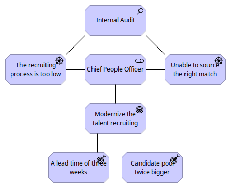
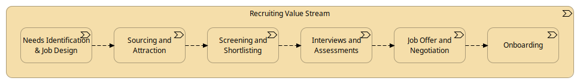
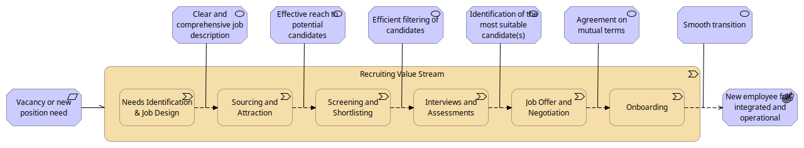
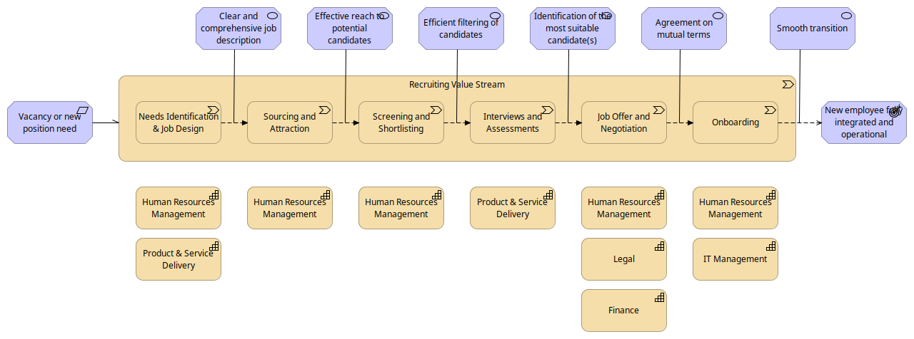
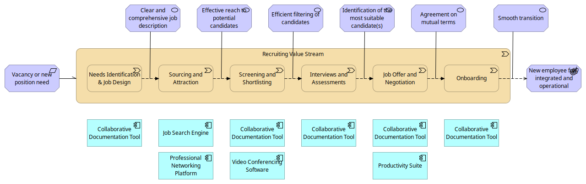
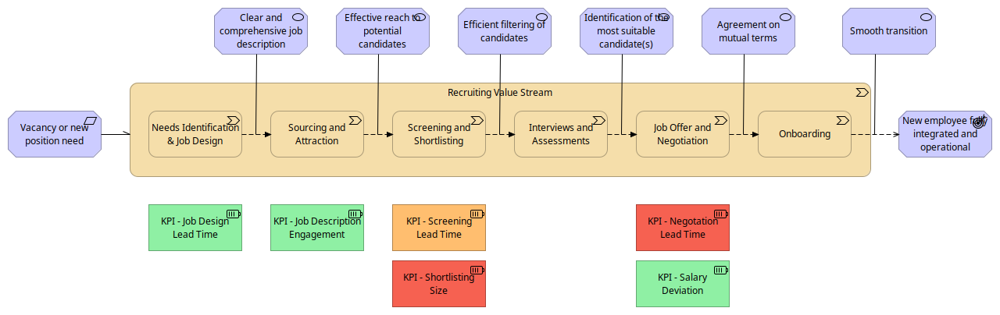

= Value Stream: a practical introduction
:author: Thibault Morin
:revdate: 2024-04-23
:revnumber: 4
:toc:
:icons: font
:source-highlighter: coderay
:doctype: article
:description: The article discusses the practical applications of the Value Stream technique as described by the TOGAF® Standard.
:copyright: CC BY 4.0

== Introduction

In today's competitive landscape, the primary purpose of any enterprise is unmistakable: to deliver value. Understanding how this value is created, tracked, and enhanced is pivotal for crafting an efficient and successful business model. However, recognizing and quantifying value can be elusive, posing significant challenges in evaluating an organization’s capabilities and aligning its operations with its strategic objectives.

Value, as a concept, often remains abstract and intangible, making it difficult for businesses to grasp and measure effectively. This ambiguity leads to critical questions: Are our efforts aligning with our core objectives? Are we truly delivering what we promise to our stakeholders?

To address these challenges, https://pubs.opengroup.org/togaf-standard/index.html[TOGAF®], a globally recognized enterprise architecture framework, offers a structured approach through its https://pubs.opengroup.org/togaf-standard/business-architecture/value-streams.html[TOGAF® Series Guide to Value Streams]. This guide provides enterprises with a methodology to model and understand the flow of value creation, ensuring that every aspect of the business contributes to its overarching goals.

A Value Stream is defined as a series of activities that work in sequence to provide value to stakeholders. It is inherently stakeholder-centric, focusing on delivering specific benefits at each stage of the process. By grouping activities into stages, a Value Stream ensures that each contributes a tangible increment of value, making the abstract concept of "value" more concrete and measurable.

This systematic approach not only clarifies what enterprises should be doing but also enhances their capacity to evaluate and refine their operations continually.

With a foundational understanding of Value Streams and their significance, our next discussion will delve into a fictional scenario. This will illustrate how implementing Value Streams can practically resolve common business challenges, fostering a clearer path to efficiency and strategic success.

== The fictive scenario

In our exploration of Value Stream management, we'll utilize a fictive scenario involving Company XYZ, a provider of B2B services through a digital platform. This scenario will guide us through practical applications of the Value Stream technique, highlighting its impact on streamlining and optimizing business processes.

Company XYZ recently conducted an internal audit which revealed significant inefficiencies in their recruiting process. Compared to market standards, their recruitment cycle is notably slow, and they often struggle to source candidates who are the right fit for their roles. These findings have propelled the company to prioritize the modernization of their talent recruitment strategy.

In response to these challenges, Company XYZ has set ambitious new targets to overhaul their recruitment process:

* *Reduce the Lead Time*: The goal is to cut down the time to identify and engage the best candidates to approximately three weeks.
* *Expand the Candidate Pool*: They aim to double the size of their candidate pool, ensuring a richer selection of potential hires.

To achieve these objectives, the Chief People Officer has outlined the "Talent Recruiting Modernization Plan." The first step in this initiative is to map out the baseline of the existing recruiting process and identify the key enterprise capabilities that support this value stream.

The overall motivation can be summarized with the following ArchiMate diagram.

.ArchiMate: Motivation View

In our next section, we will dive deeper into the Value Stream by describing its current state at Company XYZ. This will provide a clear starting point for identifying opportunities for improvement and aligning the recruitment process more closely with the strategic goals of the company.

== Step #1: Description of the value stream

Understanding and aligning on the initial steps of the Value Stream technique is required to support the successful implementation of any strategic initiative within an organization. The description of the Value Stream is particularly pivotal as it lays the groundwork for all subsequent activities and decisions.
The detailed description of a Value Stream serves multiple essential purposes:

* *Clarification*: It provides all stakeholders with a clear and concise understanding of the Value Stream, ensuring everyone is on the same page regarding its scope and function.
* *Alignment*: It aligns stakeholders around common goals and objectives, facilitating better communication and cooperation across departments.
* *Reference Point*: It acts as a foundational reference that guides the subsequent stages of Value Stream design and implementation.

A comprehensive Value Stream description includes several key components:

* *Name*: Identifies the Value Stream, making it easily referable.
* *Description*: Outlines the activities and processes involved.
* *Stakeholders*: Lists the key personnel and departments involved who will either impact or be impacted by the Value Stream.
* *Value*: Defines the direct benefits that the Value Stream aims to deliver to the organization.

For Company XYZ, the Value Stream for the "Talent Recruiting Modernization Plan" can be described down as follows:

* *Name*: Recruiting
* *Description*: This Value Stream encompasses all activities involved in sourcing, evaluating, and securing qualified candidates for employment positions within the company.
* *Stakeholders*: The Chief People Officer, responsible for overseeing the recruitment process and ensuring it aligns with organizational goals.
* *Value*: The primary value derived from this Value Stream is the acquisition of skilled and well-matched employees who are efficiently onboarded and can contribute effectively to the organization's objectives.

Having established a clear description of the Value Stream, the next step involves its decomposition. This entails breaking down the Value Stream into more manageable, discrete stages, each of which will be analyzed and optimized. In the upcoming section, we will explore how the Recruiting Value Stream at Company XYZ is decomposed into specific activities and processes, setting the stage for targeted improvements and innovations.

== Step #2: Decomposition of the value stream

After establishing a clear description of the Value Stream, the next step in the Value Stream technique is its decomposition into distinct stages. This breakdown allows for a focused examination of each part of the process, enabling specific improvements and enhancements tailored to each stage.

For Company XYZ's "Talent Recruiting Modernization Plan", the recruiting process is segmented into the following stages, each of which plays a role in the overall effectiveness of recruitment:

1. *Needs Identification & Job Design*: This initial stage involves identifying the specific needs of the organization and designing job descriptions that accurately reflect the skills and competencies required for the roles.

2. *Sourcing and Attraction*: In this phase, the company actively seeks out potential candidates through various channels, aiming to attract a diverse and qualified candidate pool.

3. *Screening and Shortlisting*: Applications are screened, and candidates who best meet the job requirements are shortlisted for further evaluation.

4. *Interviews and Assessments*: Shortlisted candidates undergo interviews and assessments to gauge their suitability for the position in terms of both skills and cultural fit.

5. *Job Offer and Negotiation*: Successful candidates are extended job offers, and terms of employment are negotiated to mutual satisfaction.

6. *Onboarding*: Once an offer is accepted, the onboarding process begins, ensuring that new hires are effectively integrated into the company and positioned for success.

A first illustration of the Value Stream decomposition into stages can be modeled as a linear sequence, with each stage building upon the previous one to achieve the ultimate goal of acquiring and retaining top talent.

.ArchiMate: The Recruiting Value Stream in step #2

With the stages of the Recruiting Value Stream clearly laid out, the next step involves a detailed description of each stage. This deeper exploration will provide insights into the specific activities, goals, and key performance indicators associated with each part of the recruitment process. We will examine how each stage can be optimized to meet the ambitious goals set by Company XYZ to streamline recruitment and enhance the quality of new hires.

== Step #3: Description of the stages

////
stages:
- Needs Identification & Job Design
    - Description: This phase involves identifying the need for a new or replacement position, defining job requirements, responsibilities, and qualifications.
    - Stakeholders: Hiring Managers, HR Department
    - Entrance Criteria: Recognition of a vacancy or new position need.
    - Exit Criteria: A detailed job description and role requirements are finalized and approved.
    - Value Item: Creation of a clear, comprehensive job description aligning with organizational needs.
- Sourcing and Attraction
    - Description: This phase focuses on attracting qualified candidates using various channels like job postings, social media, headhunting, and networking.
    - Stakeholders: Recruitment Team
    - Entrance Criteria: Approved job description and role requirements.
    - Exit Criteria: A pool of potential candidates has been attracted and applications received.
    - Value Item: Effective reach to potential candidates, increasing the pool of qualified applicants.
- Screening and Shortlisting
    - Description: In this phase, applications are reviewed, and candidates are shortlisted based on their qualifications, experience, and fit for the role.
    - Stakeholders: HR Personnel, Hiring Managers, Screening Committee
    - Entrance Criteria: Receipt of candidate applications.
    - Exit Criteria: A shortlist of qualified candidates prepared for the next stage.
    - Value Item: Efficient filtering of candidates, ensuring only suitable ones proceed further.
- Interviews and Assessments
    - Description: Selected candidates are interviewed and may undergo assessments to evaluate their skills, competencies, and cultural fit.
    - Stakeholders: Hiring Managers, HR Personnel, Potential Team Members
    - Entrance Criteria: Shortlisted candidates ready for evaluation.
    - Exit Criteria: Final candidates identified for the job offer.
    - Value Item: Thorough assessment leading to identification of the most suitable candidate(s).
- Job Offer and Negotiation
    - Description: Successful candidates are offered the job, and terms of employment are negotiated, including salary, benefits, and start dates.
    - Stakeholders: HR Department, Hiring Managers, Selected Candidates
    - Entrance Criteria: Final candidates identified.
    - Exit Criteria: Acceptance of the job offer and completion of employment contract.
    - Value Item: Securing the commitment of the selected candidate and agreement on mutual terms.
- Onboarding
    - Description: This final phase involves orienting the new employee to the company, including training, introductions to team members, and understanding company policies.
    - Stakeholders: HR Personnel, New Employee, Department Team Members
    - Entrance Criteria: Signed employment contract.
    - Exit Criteria: New employee fully integrated and operational in their role.
    - Value Item: Smooth transition of the new employee into the organization, contributing to team and company goals.
////

For Company XYZ's "Talent Recruiting Modernization Plan," the third step in the Value Stream technique involves a detailed breakdown of each stage within the recruiting process. This detailed description includes naming each stage, defining its key activities, identifying stakeholders, setting entrance and exit criteria, and pinpointing the specific value each stage offers.

A table representation is used to illustrate each stage, providing a clear and structured overview of the recruiting process. This breakdown enables stakeholders to understand the flow of activities, dependencies between stages, and the value generated at each step.

[cols="h,a,a,a,a,a"]
|===
|Stage |Description |Stakeholders |Entrance Criteria |Exit Criteria |Value Items

|Needs Identification & Job Design
|This phase involves identifying the need for a new or replacement position, defining job requirements, responsibilities, and qualifications.
|Hiring Managers, HR Department
|Recognition of a vacancy or new position need.
|A detailed job description and role requirements are finalized and approved.
|Creation of a clear, comprehensive job description aligning with organizational needs.

|Sourcing and Attraction
|This phase focuses on attracting qualified candidates using various channels like job postings, social media, headhunting, and networking.
|Recruitment Team
|Approved job description and role requirements.
|A pool of potential candidates has been attracted and applications received.
|Effective reach to potential candidates, increasing the pool of qualified applicants.

|Screening and Shortlisting
|In this phase, applications are reviewed, and candidates are shortlisted based on their qualifications, experience, and fit for the role.
|HR Personnel, Hiring Managers, Screening Committee
|Receipt of candidate applications.
|A shortlist of qualified candidates prepared for the next stage.
|Efficient filtering of candidates, ensuring only suitable ones proceed further.

|Interviews and Assessments
|Selected candidates are interviewed and may undergo assessments to evaluate their skills, competencies, and cultural fit.
|Hiring Managers, HR Personnel, Potential Team Members
|Shortlisted candidates ready for evaluation.
|Final candidates identified for the job offer.
|Thorough assessment leading to identification of the most suitable candidate(s).

|Job Offer and Negotiation
|Successful candidates are offered the job, and terms of employment are negotiated, including salary, benefits, and start dates.
|HR Department, Hiring Managers, Selected Candidates
|Final candidates identified.
|Acceptance of the job offer and completion of employment contract.
|Securing the commitment of the selected candidate and agreement on mutual terms.

|Onboarding
|This final phase involves orienting the new employee to the company, including training, introductions to team members, and understanding company policies.
|HR Personnel, New Employee, Department Team Members
|Signed employment contract.
|New employee fully integrated and operational in their role.
|Smooth transition of the new employee into the organization, contributing to team and company goals.

|===

The ArchiMate representation can be enriched by including the value of each step in the stage, along with the requirement that triggers the value stream and the outcome influenced by its fulfillment.

.ArchiMate: The Recruiting Value Stream in step #3

Having defined each stage in detail, the fourth step in the Value Stream technique involves mapping specific organizational capabilities to these stages. This step is essential for identifying which capabilities need to be developed or enhanced to optimize each stage of the recruitment Value Stream. In the next section, we will explore how Company XYZ aligns its capabilities with the demands of each stage to ensure the recruitment process is both efficient and effective.

== Step #4: Mapping capabilities to stages

In advancing the Value Stream technique within the framework of TOGAF (The Open Group Architecture Framework), the fourth step involves the task of mapping specific organizational capabilities to the stages defined in the recruitment process. This step ensures that each stage is supported by the necessary capabilities, enhancing the effectiveness and efficiency of the entire process.

In TOGAF, a capability is defined as an ability that an organization, person, or system possesses. Capabilities are typically expressed in general and high-level terms and may include an organization's ability to manage, perform, and govern itself efficiently. These capabilities are developed over time and are fundamental for executing strategies and reaching objectives.

For Company XYZ, the following main capabilities have been identified:

- **Human Resources Management**: This capability is involved at nearly every stage of the recruiting process.
- **Product & Service Delivery**: Predominantly engaged during the first stage to support the identification and design of job needs. This capability is also crucial during the Interviews and Assessments stage to provide accurate feedback.
- **Legal**: Required during the Job Offer and Negotiation stage to ensure the legality and viability of the offer.
- **Finance**: Also essential during the Job Offer and Negotiation stage to ensure the financial viability of the offer.
- **IT Management**: Ensures that new joiners receive the appropriate tools and technology support during the onboarding process.

.ArchiMate: The Recruiting Value Stream in step #4

After mapping capabilities to each stage of the Value Stream, the subsequent step is to link additional relevant elements to every stage. These elements, or artifacts, could include specific applications and key participants essential for the effective completion of each stage within the architectural framework.

== Step #?: Mapping artifacts to stages

In optimizing a Value Stream, an essential step involves mapping various artifacts to each stage. Artifacts, in this context, can include applications, actors, Key Performance Indicators (KPIs) ... This mapping not only aids in identifying areas for potential improvements but also ensures that the Value Stream aligns with the strategic objectives of the organization.

By mapping the specific applications and tools used in each stage of the Value Stream, we can assess their effectiveness and identify needs for upgrades or new technology integrations. For example, during the "Screening and Shortlisting" stage, the use of advanced applicant tracking systems (ATS) is missing and can be evaluated to see if they meet the efficiency needs of the organization.

.ArchiMate: The Recruiting Value Stream mapped with involved applications

Mapping existing KPIs to each stage is crucial for measuring performance and outcomes effectively. This process helps pinpoint where new KPIs might be needed or where existing ones require refinement. For instance, in the "Job Offer and Negotiation" stage, KPIs related to offer acceptance rates is missing and could be analyzed to gauge efficiency and effectiveness.

Introducing a heat map dimension into the Value Stream representation can visually highlight areas that require attention. Colors can indicate stages under-performing or excelling, providing a clear visual guide for stakeholders to understand where improvements are necessary.

.ArchiMate: The Recruiting Value Stream mapped with KPI and heat map

Having thoroughly mapped out the artifacts to each stage and explored the implications of this mapping, the next part of our discussion will conclude our examination of the Value Stream technique.

== Conclusion

Throughout this article, we have explored the practical applications and significant benefits of implementing the Value Stream technique, guided by the TOGAF® Standard, within an enterprise context.

Key Takeaways:

- *Strategic Alignment*: The Value Stream technique is a great tool for aligning business operations with strategic objectives.

- *Enhanced Clarity and Efficiency*: Decomposing complex processes into clearly defined stages helps in pinpointing inefficiencies and identifying opportunities for improvement. For Company XYZ, this method facilitated a targeted approach to modernizing their recruitment process, ultimately enhancing operational efficiency and effectiveness.

- *Stakeholder Engagement*: Detailed descriptions and visual representations (such as ArchiMate diagrams) of the Value Stream engage stakeholders across different levels of the organization, fostering a deeper understanding and collaboration towards common objectives.

- *Capability Development*: Mapping capabilities to stages within the Value Stream allows for a targeted development of resources and skills needed to support each phase of the value creation process.

In conclusion, the systematic application of the Value Stream technique provides a powerful framework for enterprises, enabling them not only to visualize and improve their operational processes but also to enhance their capability to deliver value consistently and effectively. As demonstrated by Company XYZ, this approach significantly improves efficiency and stakeholder satisfaction by providing a clear view of the current state and facilitating an efficient design of the future state.
